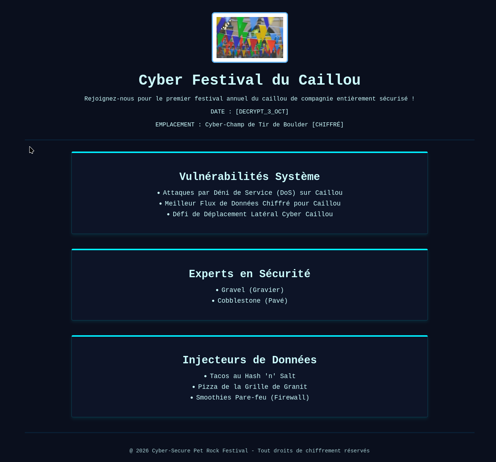

# 🪨 Cyber Festival du Caillou - Landing Page

Bienvenue sur le dépôt du **Cyber Festival du Caillou**, le tout premier événement annuel dédié à la sécurité informatique des cailloux de compagnie ! 

Ce projet est un site vitrine (Landing Page) développé en **HTML5** et **CSS3** qui applique les fondamentaux du design d'interface (UI) et du Dark Mode dans un univers parodique mêlant la cybersécurité et la géologie.

---

## 🎨 Objectifs Pédagogiques & UI

Ce mini-projet a été conçu pour valider et ancrer plusieurs compétences clés en intégration web et web design sans utiliser de frameworks complexes :

* **Hiérarchie Visuelle & Échelle :** Utilisation de typographies distinctes (style terminal/monospace) et de tailles de polices proportionnelles pour guider l'œil (Titres principaux > Sous-sections > Listes de puces).
* **Contraste & Dark Mode :** Sélection d'une palette de couleurs "Cyber" ultra-sombre (bleu nuit profond) associée à des textes clairs et des accents néons (Cyan) pour garantir une excellente lisibilité.
* **Effets de style CSS (Zonage) :** Création de cartes de contenu thématiques isolées par des bordures lumineuses (`box-shadow` à effet néon), renforçant l'aspect immersif et technologique.
* **Structure Sémantique HTML :** Organisation propre du document avec les balises structurelles appropriées (`<header>`, `<main>`, `<section>`, `<article>`, `<footer>`).

---

## 🛡️ Contenu du Festival

Le site présente le programme et les intervenants à travers trois grands blocs thématiques :
1. **Vulnérabilités Système :** Focus sur le déplacement latéral et les attaques par Déni de Service (DoS) appliquées aux cailloux.
2. **Experts en Sécurité :** Présentation des têtes d'affiche de l'événement (*Gravel* et *Cobblestone*).
3. **Injecteurs de Données (Food & Drinks) :** Le menu du festival revisité version cyber (*Tacos au Hash 'n' Salt*, *Smoothies Pare-feu*).

---

## 🛠️ Technologies Utilisées

* **HTML5** : Structuration sémantique du contenu.
* **CSS3** : Design system personnalisé, gestion des marges (whitespace), typographies et effets visuels de lueurs néon.

---
## 🚀 Live Demo Link
https://cedricboucard.github.io/fcc-event-flyer-page/

